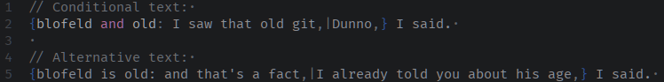
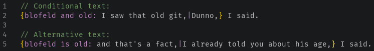
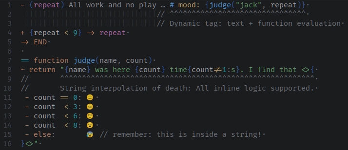
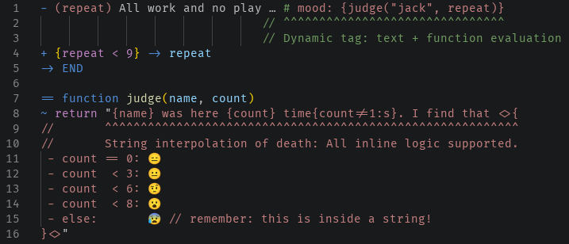

# Tree-Sitter-Ink

This is a [Tree-sitter] grammar for the [Ink] interactive fiction scripting language.
It supports all syntax up to version 1.2.0.

<video
	id="navigation-example"
	src="https://github.com/wldmr/tree-sitter-ink/assets/5498491/cbfa71db-1cec-4a19-9966-35b9c838bffc"
	width="767px">
</video>

[Tree-sitter]: https://tree-sitter.github.io/tree-sitter/
[Ink]: https://www.inklestudios.com/ink/

## Editor Support

See the [`queries/editors`](queries/editors/) directory. If your editor is supported,
the corresponding subfolder should contain everything you need.

> [!NOTE]
> If you'd like to see your editor supported, feel free to open a PR.

- [ ] Vim
- [ ] Neovim
- [ ] Emacs
- [x] Helix

  Put `languages.toml` and the `*.scm` files in your Helix user config (e.g. `~/.config/helix/`).

  For details see the [Helix guides](https://docs.helix-editor.com/languages.html).

- [ ] VSCode
- [ ] \[… your editor here …\]

## Why?

Inkle themselves provide [syntax files for Sublime 3](https://github.com/inkle/ink/tree/master/Sublime3Syntax),
but tree-sitter is more powerful.

### Semantic nesting of language elements

In general, tree-sitter allows for not just highlighting, but also source code navigation, indenting, etc.
For example, Helix uses tree-sitter to quickly select functions, comments, tests, …, based on syntax/semantics.

Knots, Stitches, Choices, and Gathers are all properly nested, so you can navigate ink “semantically”.
The [example video above](#navigation-example) showcases this.

### Distinction between conditional text and alternative text

This grammar allows distinguishing between an expression in
conditional text, and similar-looking normal text in alternatives:


This grammar makes the difference visible:



Standard textmate grammar treats both cases as the same thing.
It highlights the part before the `:` as an expression, although it isn't one:



<details>

The difference is subtle, so here's a "diagram" to explain the difference:

```ink
// Conditional text:
{blofeld and old: I saw that old git,|Dunno,} I said.
/*       ^^^ `and` is an operator, therefore
 |-------------| <- all this is an expression
|-------------------------------------------| <- and this is conditional text */

// Alternative text:
{blofeld is old: and that's a fact,|I already told you about his age,} I said.
/*       ^^ `is` is *not* an operator, therefore
 |--------------------------------| <- all this is just text
|--------------------------------------------------------------------| <- and this is a _sequence_ (a type of alternative text) */
```

</details>


### Highlight code inside tags an strings

Ink supports code evaluation inside of tags and string (to create them dynamically based on game state). This grammar supports this. So the following ink is fully highlighted:

<!--
```ink
- (repeat) All work and no play … # mood: {judge("jack", repeat)}
                               // ^^^^^^^^^^^^^^^^^^^^^^^^^^^^^^^
                               // Dynamic tag: text + function evaluation
+ {repeat < 9} -> repeat
-> END

== function judge(name, count)
~ return "{name} was here {count} time{count!=1:s}. I find that <>{
//       ^^^^^^^^^^^^^^^^^^^^^^^^^^^^^^^^^^^^^^^^^^^^^^^^^^^^^^^^^^
//       String interpolation of death: All inline logic supported.
 - count == 0: 😑
 - count  < 3: 😐
 - count  < 6: 🤨
 - count  < 8: 😮
 - else:       😰 // remember: this is inside a string!
}<>"
```
-->



while this is how the standard textmate grammar handles this:


